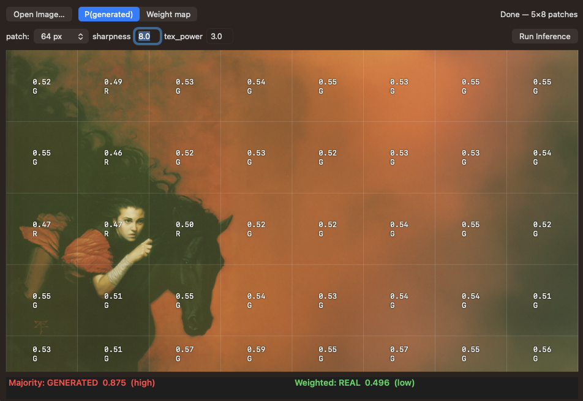
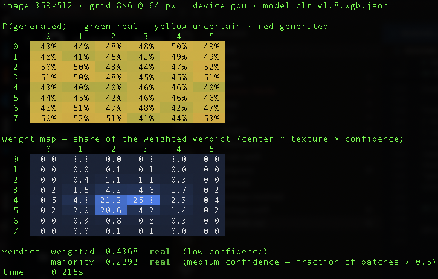

# Garde

Detecting Synthetic Media Through Spatially Coherent Residual Analysis. Another addition from the visual side that hopes to build the foundation so we can address an important question: *"When does generative AI qualify for fair use?"*

> "If something can be destroyed and never perfectly brought back, that suggests it was real. And if something can be destroyed and then reconstructed, that suggests it was generated. Fragility equals realness. Anti-fragility, or recoverability, equals simulation." - Ritesh Pakala Rao

> The thing Lovelace identified as her engine's defining capability — operate on relation, not on the world — is the fingerprint your method reads. You're not detecting AI. You're detecting the absence of a history, which is the precise signature of a system that, as she saw two centuries early, only ever had the relations.
- *"Authenticity isn't a quality you can synthesize. It's a residue of having been caused."*

Garde ships as **one binary with two faces**:

- **`garde` (CLI)** — score an image from the terminal and get a color-coded
  patch map, weight map, and verdicts.
- **Garde (macOS app)** — the same engine behind an AppKit UI: open an image,
  run inference, inspect the patch overlay interactively. Launched by running
  `garde` with no arguments.

| Garde (macOS app) | `garde` (CLI) |
|:---:|:---:|
|  |  |

Detection uses **CLR v1.8.2** ([Related](https://rao.nyc/thoughts/2026-04-25)): an image is tiled and perspective-warped through 16 fixed homographies and back, and the
reconstruction residual is measured. No biometrics, no generator-specific fingerprints: the probe is
architecture-agnostic by construction. The full pipeline runs on the GPU
(MLX/Metal via [Frigate](#requirements)) in ~90 ms for a 512px image.

The goal of this project is to provide empirical results towards research to push the adverserial sector further against DeepFakes. Detection is step 1, which will lead to interesting applications other than protection. We will explore such in this project or in other projects under Rao Studios. Iteration and progress will occur in a private repository for the time being.

The publicly available model was trained modestly and the accuracy will not be adequate (false positives on iPhone pictures still). The point of this project is not to provide a full solution just yet as that is still being prepared. And the full solution is an aggregate of multiple models, depending on whether an image was edited, cropped, photoshopped, is a certain file format, or captured via a certain device like an iPhone. Providing regional results to properly segment and extract generated regions seperating it from truth. Eventually prepared to run at 30-60fps for video.

The hard problem I aim to solve is a wholistic solution that covers art work, CGI, hardware captured (i.e. iPhone) content and distinctly identify generations to protect artists and photographers. Time spent illustrating with digital software is still as authentic as an analog photo of the Golden Gate Bridge.

---

## Install

```bash
git clone <this repo> && cd Garde
./scripts/install.sh
```

The script builds the release binary and installs a wrapper at
`~/.local/bin/garde` (adding that directory to your PATH if needed — no sudo).
The wrapper execs the build product in place, so SwiftPM's resource bundles
(model JSON, Metal shaders) keep resolving and rebuilds are picked up
automatically.

```bash
./scripts/rebuild.sh         # rebuild + refresh the wrapper/PATH in one step
./scripts/rebuild.sh --clean # from-scratch build (stale SwiftPM caches)
garde --help
```

(A plain `swift build -c release` also works — the wrapper execs the build
product in place, so it picks up rebuilds without reinstalling.)

Requirements: <a name="requirements"></a> macOS 14+, Apple Silicon, Xcode
toolchain. Depends on **Frigate** (vendored MLX fork), fetched by SwiftPM from
[rao-studios/Frigate](https://github.com/rao-studios/Frigate) (`main`).

## CLI

```
garde <image> [options]          score an image
garde                            open the macOS app

  --patch N              outer patch size: 64 (default) | 128 | 256
  --repeat N             rerun inference N times (run 1 = warmup; time runs 2+)
  --json out.json        also write machine-readable JSON to a file
  --json -               print ONLY JSON to stdout (for piping)
  --model m.xgb.json     override the bundled model
  --cpu                  force the MLX default device to CPU (GPU A/B check)
  --exact-warp           disable cv2's 1/32-px coordinate quantization (debug)
  --no-color             plain text patch map
  --dump-features f.json write the raw [nTiles, 10] feature matrix (parity debug)
  --verify-warp fix.json check the warp pipeline against a cv2 fixture and exit

  CLR_TIMING=1           env var: per-phase timings + device log on stderr
```

### Examples

```bash
# Score one image, read the color-coded patch map
garde photo.png

# Coarser grid, steady-state timing over warm runs
garde photo.png --patch 256 --repeat 4

# Machine-readable output for scripts
garde photo.png --json - | jq .verdict

# Prove the hot path runs on Metal (~35× slower on CPU)
garde photo.png --cpu

# Where does the time go?
CLR_TIMING=1 garde photo.png --repeat 2
```

### Reading the output

```
Garde (CLR v1.8.2) — photo.png
image 512×512 · grid 8×8 @ 64 px · device gpu · model clr_v1.8.xgb.json

P(generated) — green real · yellow uncertain · red generated
        0     1     2     3     4     5     6     7
  0    53%   54%   58%   57%   57%   48%   54%   50%
  ...

weight map — share of the weighted verdict (center × texture × confidence)
  ...

verdict  weighted  0.6150  generated  (low confidence)
         majority  0.8594  generated  (high confidence — fraction of patches > 0.5)
time     1.426s (warmup) · 0.326s
```

- **P(generated) map** — one cell per patch: mean XGBoost probability over its
  32×32 tiles. Localized red clusters on a green image are the interesting
  case (composited / inpainted regions). A flat yellow field means the image
  is genuinely borderline — treat the verdict with corresponding skepticism.
- **weight map** — each patch's share of the weighted verdict: a Gaussian
  centered on the highest-texture region × texture energy × confidence boost.
  Bright cells are the patches the verdict actually listened to.
- **verdict** — `weighted` is the production score (with a blend toward
  high-confidence generated patches); `majority` is the unweighted fraction of
  patches above 0.5. Disagreement signals a mixed image. Confidence: `high`
  ≥ 0.30 from 0.5, `medium` ≥ 0.15, else `low`.
- The right/bottom edge patches are scored on reflect-padded full patches but
  reported with their real, clipped footprint in the JSON.

## macOS app

`garde` with no arguments (or double-click the binary). Open an image, pick a
patch size (64/128/256), Run Inference — the patch grid renders over the image
with a P(generated)/weight-map toggle and live per-patch progress.

## Model

The bundled `clr_v1.8.xgb.json` (default) is the JSON export of
`xgboost_tile32_v1.8_t9_final_1.pkl`; `clr_tile32_v1.8_t9_final_4k_20k.xgb.json`
is also bundled and selectable via `--model`. Feature order (must match
training): `FR, LV, CV, CM, CC, CR, SH, SV, SH_S, SV_S`.

Training notebooks, dataset preparation, parity fixtures
(`dump_reference.py`), the validation harness
(`validation_experiments.py`), and the end-to-end methodology review
(`Understanding.md` — including known calibration caveats and the improvement
roadmap) live in the **Ra research repo** under `notebooks/clr/`. Of note from
that review: the raw 0.5 decision threshold is conservative toward
"generated" — borderline scores (|score − 0.5| < ~0.05) should be read as
*inconclusive*, and a calibration pass is on the roadmap.

## License

AGPL — see [LICENSE](LICENSE).
